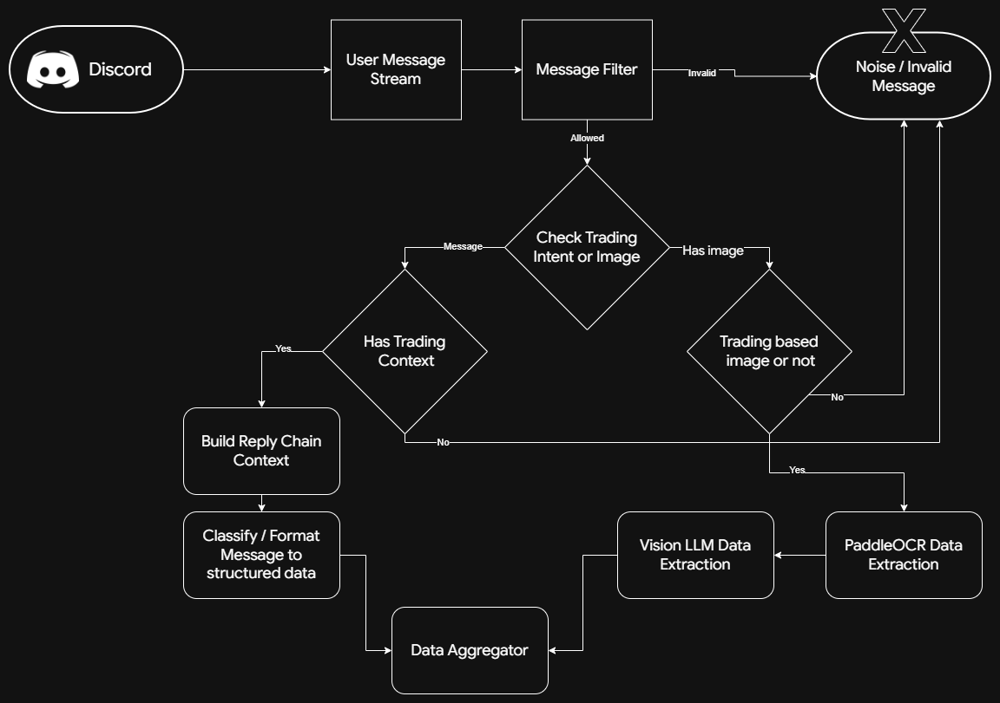

# Frenzy

> [!WARNING]
> This project includes automation around Discord account activity. Automating Discord accounts can violate Discord Terms of Service. We do not promote, encourage, or endorse violating Discord ToS.

## What's this?
Frenzy is a completely automated trading agent capable of ingesting general chat messages from social media, analysing them through LLMs, syncing with market data and performing trades.


> Current workflow given above is inclusive of only existing features in production!
## Installation

> [!NOTE]
> **[Bun](https://bun.sh) is suggested to run this!**

> ### OCR Server
```bash
pip install -r requirements.txt
```

> ### Frenzy Dependencies
```bash
bun install
```
------------------------------------
> ### `.env` Configuration

```env
DISCORD_TOKEN= # Discord User account token
DISCORD_BOT_TOKEN= # Discord bot token
GROQ_API_KEY= # Groq api key
OPENROUTER_API_KEY= # openrouter api key
MONGODB_URI= # mongo db url
```

> ### `config.ts` Configuration
```ts
export const config = {
  token: process.env.DISCORD_TOKEN || "",
  GROQ_API_KEY: process.env.GROQ_API_KEY || "",
  discordServers: [ ], // <=========================== ID of Discord Servers to scan ===========
  OPENROUTER_API_KEY: process.env.OPENROUTER_API_KEY || "",
  DISCORD_BOT_TOKEN: process.env.DISCORD_BOT_TOKEN || "",
  tradeLog: "1496571283930878092", // <============= Main Channel to log ===========
  liveTrade: "1496575116027498677", // <============ Channel where live portfolio will be presented ====
  portfolioLog: { // <=========================== Trade status logs ===========
    create: "1496571337295266102",
    open: "1496571303002374215",
    close: "1496571314369073154",
  },
  MONGODB_URI: process.env.MONGODB_URI || "",
};

export const tradeConfig = {
  leverage: 10, // <=========================== Maximum leverage ===========
  riskPerTrade: 0.05, // <===================== Maximum portfolio % risk ===========
};
```

------------------------------------
## Run
Start the PaddleOCR server first:

```bash
uvicorn paddleOCR:app --host 127.0.0.1 --port 8000
```

Then, in a separate terminal, start the app with:

```bash
bun run src/index.ts
```

## TODO List

- [x] Discord Users trade/market sentiment analyser
- [ ] Technical Indicator analyser (AI model)
- [ ] ForexFactory/Bloomberg/FinHub News Listener
- [ ] Youtube Live Stream analyser
- [ ] Multi-agent conversational trade decision picker
- [ ] Reddit/Telegram
- [ ] [Hyperdash](hyperdash.com) data scraper & aggregator

## Environment Notes
The OCR service is expected at `http://127.0.0.1:8000/parse-chart`. Discord server and channel IDs, along with runtime constants, are configured in `config.ts`.
